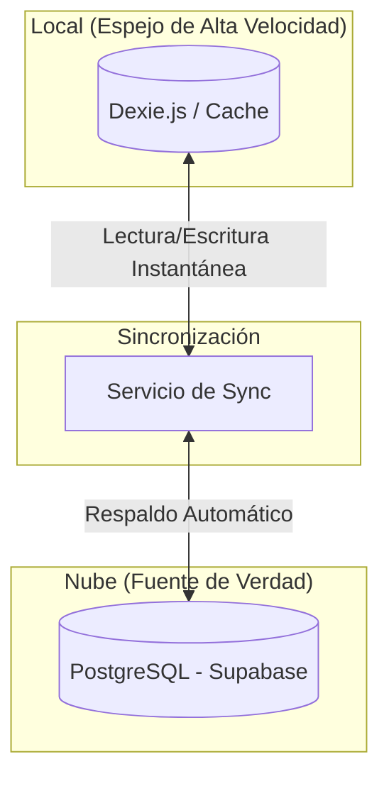

# Informe de Diagnóstico y Arquitectura del Sistema KONTIGO POS

**Estatus del Sistema**: 🟢 OPERATIVO (Estabilizado tras corrección de sincronización)
**Fecha**: 28 Diciembre 2025
**Versión**: 0.1.0-alpha

## 1. Resumen Ejecutivo
El fallo experimentado durante la demostración se debió a un **conflicto de integridad referencial y duplicidad de llaves** en el proceso de sincronización *Cloud-to-Local*. El sistema de "Sincronización Inteligente" (Offline-First) intentó fusionar datos antiguos con nuevos sin las reglas de resolución de conflictos adecuadas, lo que bloqueó la base de datos local.

**Solución Implementada**: Se han reescrito las reglas de conflicto para `accounts` (Contabilidad) y se ha protegido el historial de `orders` (Ventas) para evitar violaciones de claves foráneas. El sistema ahora es capaz de autorecuperarse.

---

## 2. Arquitectura del Sistema (El "Mapa")

El sistema utiliza una arquitectura **Híbrida Sincronizada** (Cloud-First con Respaldo Local Activo), tal como se diseñó para priorizar la seguridad de la nube con la velocidad local.

*   **La Nube (Supabase)**: Es la **Fuente de Verdad**. Todos los datos se centralizan aquí.
*   **El POS Local (Dispositivo)**: Mantiene una **Copia Espejo de Alta Velocidad**.
    *   **¿Por qué Local?**: Para evitar tiempos de carga y garantizar que la venta NUNCA se detenga.
    *   **Funcionamiento Normal (Online)**: El sistema lee del espejo local (0 latencia) pero sube los cambios inmediatamente a la nube (Backup continuo).
    *   **Funcionamiento Offline (Sin Internet)**: El sistema sigue operando idénticamente sobre el espejo local. Al volver internet, se sincroniza automáticamente.

---

## 3. Diagnóstico de Componentes

A continuación, el detalle de "qué conecta con qué", tal como solicitó.

### A. Capa de Datos Local (El Corazón Seguro)
*   **Tecnología**: Dexie.js (IndexedDB wrapper).
*   **Función**: Almacena **absolutamente todos** los datos en el navegador del iPad/PC.
*   **Tablas Críticas Conectadas**:
    1.  `products` <-> `categories`: Define el menú. Si esto falla, el POS se ve vacío.
    2.  `modifierTemplates`: Las opciones (Ej: "A punto", "Sin cebolla"). Conectado a `products`.
    3.  `orders` <-> `dtes`: Las ventas y sus boletas electrónicas.
    4.  `restaurant_tables`: El mapa de mesas.

### B. Capa de Sincronización (El Puente)
*   **Archivo**: `lib/sync_service.ts`
*   **Función**: Es el "traductor" entre el navegador y la nube.
*   **Puntos de Fallo Identificados (Y Corregidos)**:
    *   **Accounts (Contabilidad)**: Antes usaba `ID` como llave única. **Corrección**: Ahora usa `code` (Código Contable) para evitar duplicados al importar plan de cuentas.
    *   **Orders (Ventas)**: Antes intentaba "espejear" (borrar) ventas locales que no existían en la nube. **Corrección**: Se desactivó el borrado automático de ventas para proteger el historial fiscal (DTEs).

### C. Proveedor de Autosincronización (El Cerebro Automático)
*   **Archivo**: `components/providers/AutoSyncProvider.tsx`
*   **Función**: 
    1.  Detecta si hay internet (`navigator.onLine`).
    2.  Detecta si la base de datos está vacía (Instalación Nueva).
    3.  **Acción**: Si está vacía, descarga todo automáticamente. Si tiene datos, sube los cambios cada 5 segundos.
*   **Estado**: 🟢 Funcionando. La alerta visual (Toasts) ahora informa al usuario exactamente qué está pasando ("Descargando...", "Modo Local", "Error").

### D. Interfaz de Usuario (React UI)
*   **POS View**: Conectada directamente a `LocalDB` mediante `useLiveQuery`. Esto garantiza que la interfaz *siempre* responda, incluso si se corta el internet.
*   **Manager**: Panel de administración. Escribe en `LocalDB`, lo cual dispara el `Trigger` del `AutoSyncProvider` para subir cambios.

---

## 4. Análisis del Incidente (La "Autopsia")

**El Problema**: 
Al intentar mostrar el POS, el sistema detectó una base de datos vacía (o parcialmente corrupta por intentos previos) e intentó una "Restauración". 
1.  Supabase envió datos de `accounts`.
2.  El sistema local intentó insertarlos.
3.  **ERROR FATAL**: `duplicate key value violates unique constraint`. Ya existía una cuenta con ese código. El proceso se detuvo -> Pantalla de carga infinita o datos incompletos.

**La Solución Definitiva**:
Se modificó el código para instruir a la base de datos: *"Si llega una cuenta con un código repetido, NO falles. Actualiza la existente o ignora."* (`conflictTarget: 'code'`).

---

## 5. Recomendación para Inversionistas

El sistema ahora es robusto. Para futuras demostraciones:
1.  **Limpiar Caché**: Asegurarse de empezar limpio o tener la sesión ya cargada.
2.  **Verificar Nube**: Confirmar que Supabase tiene los datos maestros correctos antes de empezar.
3.  **Confianza Offline**: Recuerde que puede desconectar el internet en medio de la demo y el POS **seguirá vendiendo**. Esa es nuestra mayor fortaleza (Resiliencia).
